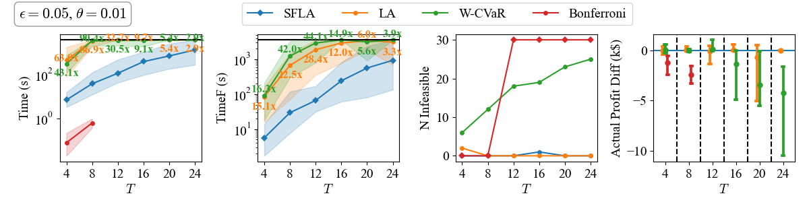
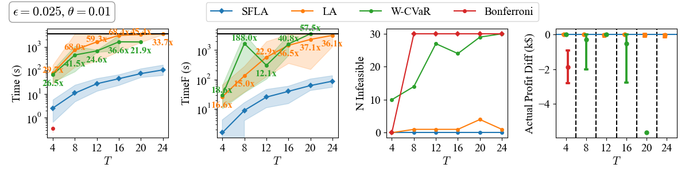
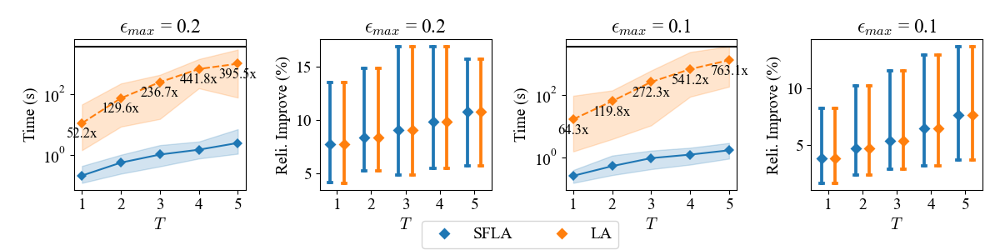
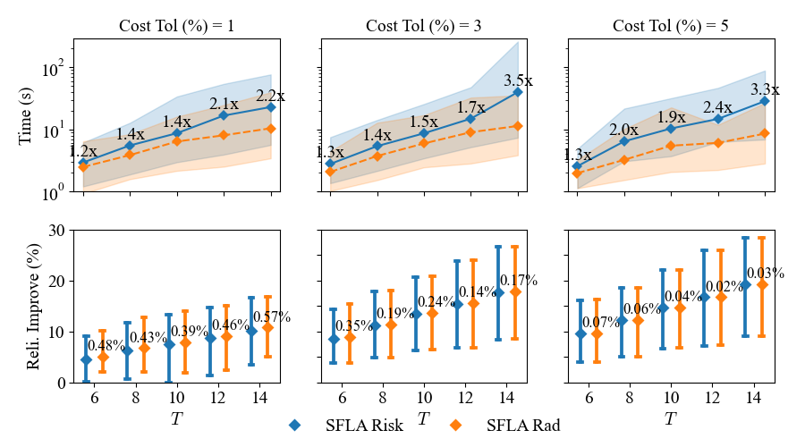

[](https://pubsonline.informs.org/journal/ijoc)

# Strengthened and Faster Linear Approximation to Joint Chance Constraints with Wasserstein Ambiguity

This archive is distributed in association with the [INFORMS Journal on Computing](https://pubsonline.informs.org/journal/ijoc) under the [MIT License](LICENSE.md).

The software and data in this repository are a snapshot of the software and data
that were used in the research reported on in the paper
[Strengthened and Faster Linear Approximation to Joint Chance Constraints with Wasserstein Ambiguity](https://doi.org/10.1287/ijoc.2024.1073) by
Yihong Zhou, Yuxin Xia, Hanbin Yang, and Thomas Morstyn.

## Cite

To cite the contents of this repository, please cite both the paper and this repo, using their respective DOIs.

Paper DOI: https://doi.org/10.1287/ijoc.2024.1073

Code DOI: https://doi.org/10.1287/ijoc.2024.1073.cd

Below is the BibTex for citing this version of the repository.

```bibtex
@misc{Zhou2024,
  author =     {Yihong Zhou, Yuxin Xia, Hanbin Yang, Thomas Morstyn},
  publisher =  {INFORMS Journal on Computing},
  title =      {Strengthened and Faster Linear Approximation to Joint Chance Constraints with Wasserstein Ambiguity},
  year =       {2026},
  doi =        {10.1287/ijoc.2024.1073.cd},
  note =       {Available for download at https://github.com/INFORMSJoC/2024.1073},
}
```

## Main Contributions

This paper develops a strengthened and computationally efficient approach for solving Wasserstein Distributionally Robust Joint Chance Constraints (WDRJCC) with right-hand-side uncertainty.

### 1. Strengthened and Faster Linear Approximation (SFLA)

- Proposes a novel convex (linear) inner-approximation for RHS-WDRJCC.
- Strengthens existing formulations to:
  - Reduce the number of constraints  
  - Tighten auxiliary variable domains  
  - Significantly accelerate computation  
- It provably introduces **no additional conservativeness** and can be **less conservative** than W-CVaR.

---

### 2. Scalability to Large-Scale and Multilevel Problems

- Applicable to problems where exact mixed-integer reformulations are intractable or invalid.
- Enables practical solution of:
  - Large-scale unit commitment problems  
  - Bilevel strategic bidding problems, where the low level is a chance-constrained electricity market clearing (the system operator runs chance-constrained market clearing to ensure safety of the power grid against the increasing uncertainty brought by new demand and renewables).  

---

### 3. Robustness Maximization Framework

- Extends WDRJCC from **cost minimization** to **robustness maximization** within a cost budget, which resembles the philosophy of **robust satisficing**.
- To **maximize** robustness, you can either treat the risk level (risk minimization) or the Wasserstein radius (radius maximization) as additional decision variables, for both of which the proposed SFLA remains valid.
- Establishes the connection between risk minimization and radius maximization.
- Demonstrates the computational advantage (3.5x) and the greater robustness of radius maximization over risk minimization. Specifically, radius maximization preserves the linearity and convexity of the problem, so **we advocate using radius maximization over risk minimization for robustness maximization**.

---

### 4. Significant Computational Gains

- **Unit Commitment:** up to 10× speedup (3.8× on average) compared to the strengthened and exact mixed-integer reformulation.  
- **Bilevel Problems:** up to 90× speedup over existing convex approximations.  
- **Robustness Maximization:** over 100× speedup.

---

**Takeaway:**  
SFLA makes Wasserstein distributionally robust joint chance constraints scalable, tight, and computationally practical for large-scale and multilevel decision-making problems.


## File Description

This repo contains the following files and folders:

### Part 0: Supplementary Mathematical Formulations

- [supp_formulations.pdf](docs/supp_formulations.pdf): This PDF provides detailed mathematical formulations of the chance-constrained UC (Section 5.1) and bilevel problems (Section 5.2) examined in the numerical case studies of our paper, ``Strengthened and Faster Linear Approximation to Joint Chance Constraints with Wasserstein Ambiguity''.

### Part I: Packages and Installation

1. Git clone this repository.

2. Navigate to the folder, and run the following command to install

        conda env create -f environment.yml

3. This will create a conda environment called `sfla. Activate this by conda activate sfla (or specify it in your IDE), and you are free to run all scripts.

   **Note:** If the conda installation is slow, we strongly recommend updating Anaconda to the latest version before installing our environment.

   **Note:** This installation has been verified on Linux and Mac OS. For Windows, there may be a dependency issue.

### Part II: Data

- `data/`: The folder containing the data files (load data, wind forecast, and forecasting errors).
- `scripts/GEFC2012_wind.ipynb`: The notebook for processing and generating wind forecasting error scenarios, based on [GEFC2012 Bronze Medal forecasting results](https://www.kaggle.com/competitions/GEF2012-wind-forecasting) and ground truth.

### Part III: Codes for Numerical Experiments

- `src/WT_error_gen.py`: A helper script for processing and generating wind forecasting error scenarios.
- `scripts/SUC_clean_result_file.py`: A helper script for cleaning up and organizing generated evaluation result files.
- `src/SUC.py`: The code for solving the chance-constrained unit commitment problem. This code sets up the corresponding optimization problem for each benchmark method of RHS-WDRJCC.
  It can also be used for testing a specific parameter setting.
- `scripts/SUC_all_param_eval.py`: This code evaluates all parameter settings for all methods, as done in our paper. Joblib is used for parallel computing. Be aware of the number of available CPU cores when specifying njobs.
- `src/SUC_also.py` and `scripts/SUC_also_all_param_eval.py`: Additional scripts for evaluating extended benchmark ALSO series methods under the SUC problem.
- `src/SUC_epstheta.py` and `scripts/SUC_epstheta_all_param_eval.py`: Scripts specifically tailored for evaluating the SUC problem across varying epsilon and theta (the Robustness Maximisation section).
- `src/Bilevel_Storage.py`: This is similar to `src/SUC.py`, but for the bilevel strategic bidding problem.
- `scripts/Bilevel_storage_all_param_eval.py`: This is similar to `scripts/SUC_all_param_eval.py`, but for the bilevel strategic bidding problem.

### Part IV: Results

- `results/SUC_results_bigM100000_thread4/`: The folder containing the results of the chance-constrained unit commitment problem with big-M=100000 and 4 threads per optimization problem.
- `results/Bilevel_results_bigM100000_thread4/`: Similar to `results/SUC_results_bigM100000_thread4/`, but for the bilevel strategic bidding problem.
- Other folders correspond to the comparison with ALSO series and the robust maximization section, respectively.

### Part V: Visualization

- `scripts/SUC_result_vis.ipynb`: The notebook for visualizing the results of the chance-constrained unit commitment problem, based on the result files in `results/SUC_results_bigM100000_thread4/`.
- `scripts/SUC_also_result_vis.ipynb` and `scripts/SUC_epstheta_result_vis.ipynb`: Additional notebooks for visualizing the results from the ALSO series benchmark and case studies for the Robustness Maximisation section.
- `scripts/Bilevel_result_vis.ipynb`: Similar to `scripts/SUC_result_vis.ipynb`, but for the bilevel strategic bidding problem.
- `results/figure/`: The folder containing the figures generated by the above notebooks.

### Miscellaneous

- `scripts/Compare_SFLA_LA.py`: This code verifies that the proposed SFLA can be a proper superset of (strictly dominant) LA for general settings of $\mathbf{\kappa}$.


### Method Naming Convention

In the [SUC code](src/SUC.py) scripts, the methods are named as follows:

- `proposed`: proposed SFLA  
- `ori`: LA benchmark  
- `exact`: ExactS benchmark  
- `wcvar`: WCVaR benchmark  
- `bonferroni`: Bonferroni approximation benchmark  

In the [SUC_also code](src/SUC_also.py) scripts, the same method names are used, with two additional benchmarks:

- `slfa_also`: SLFA-ALSO benchmark (set the SFLA output as the initial upper bound of ALSO-X#)  
- `wcvar_also`: WCVaR-ALSO benchmark (set the WCVaR output as the initial upper bound of ALSO-X#, just for testing, not used in our paper because this benchmark is strictly dominated by slfa_also) 

In the [Bilevel code](src/Bilevel_Storage.py) scripts, the methods are named as follows:

- `proposed`: proposed SFLA
- `linearforN`: LA benchmark
- `wcvar`: WCVaR benchmark
- `bonferroni`: Bonferroni approximation benchmark


## Quick Start

### 1. Install dependencies

```bash
git clone https://github.com/INFORMSJoC/2024.1073.git
cd 2024.1073
conda env create -f environment.yml
conda activate sfla
```

This environment includes `gurobipy`. Make sure your Gurobi license is available on your machine before running any optimization script.

### 2. Run single-instance examples

Each script below runs one instance using the default parameters in its `main()` function:

```bash
python src/SUC.py
python src/SUC_also.py
python src/SUC_epstheta.py
python src/Bilevel_Storage.py
```

To customize a case (e.g., method, `T`, `epsilon`, `theta`, `N_WDR`), edit the parameter block at the top of `main()` in the corresponding file.

### 3. Run paper-scale batch experiments

These scripts evaluate many parameter combinations and save results automatically:

```bash
python scripts/SUC_all_param_eval.py
python scripts/SUC_also_all_param_eval.py
python scripts/SUC_epstheta_all_param_eval.py
python scripts/Bilevel_storage_all_param_eval.py
```

Before running, check `n_jobs` and `thread` in each script to match your CPU and memory budget.


## Results

All experimental outputs are stored in the `results/` directory.

In particular:

- Solver log outputs for each parameter configuration are saved as structured result files in the `results/` directory.  
The filename explicitly encodes the parameter values used in that experiment. For example:
`results_proposed_theta{theta}_epsilon{epsilon}_seed{gurobi_seed}_N{N}_T{T}_numerical_focus{numerical_focus}_IntegralityFocus{IntegralityFocus}.txt`
Here, the terms inside `{}` denote the specific parameter values used in the run (e.g., `{theta}` is replaced by the actual value of θ, `{epsilon}` by the corresponding ε value, etc.).  

- Generated figures are stored under `results/figure/`.

All figures and tables reported in the paper can be automatically reproduced from the provided Jupyter notebooks in the `scripts/` folder.

The notebooks:

- load result files from `results/`,
- generate plots programmatically,
- compute summary statistics,
- produce comparison tables across parameter settings and methods.

### Figures
Here we describe some main figures in our paper. Please refer to our paper for more plots and the detailed intepretation.

Figure 5 presents the bilevel case study results comparing the proposed SFLA method with three benchmark approaches: LA, W-CVaR, and Bonferroni.


Performance is evaluated in terms of the following metrics (see Appendix D.2 for formal definitions):

- Time (s)  
- TimeF (s)  
- N Infeasible
- Actual Profit Difference (k$)  

The results are reported under different combinations of:

- risk level (𝜖),  
- radius parameter (𝜃),  
- number of time steps (𝑇).  

The figure is automatically generated from the notebook:

`scripts/Bilevel_result_vis.ipynb`

The notebook processes the experiment output files stored in:

`results/Bilevel_results_bigM100000_thread4/`

---
Figure 6 in the paper compares the proposed SFLA method with the LA benchmark for risk minimization, under the SUC problem.

Figure 12 in the paper compares risk minimization and radius maximization using the proposed SFLA.

Performance is evaluated in terms of the following metrics (see Section 5.3 for formal definitions):
- Time (s)  
- Reli. Improve (%)

The results are reported under different combinations of:

- risk level UB (𝜖_max),   
- number of time steps (𝑇).  

The figure is automatically generated from the notebook:

`scripts/SUC_epstheta_result_vis.ipynb`

The notebook processes the experiment output files stored in:

`results/SUC_epstheta_results_bigM100000_thread4/`

---
For further figures and more detailed analyses, please refer to the paper or explore the full set of visualizations in the corresponding `.ipynb` notebook.

## Ongoing Development
You may check the [author's Github site](https://github.com/yihong-zhou) for more open-source codes on projects extended from this work.

---
